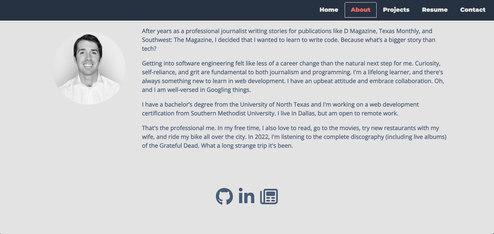

# react-portfolio

## Description
This is a portfolio I developed to practice working with React.js and writing single page applications. I'm not at all pleased with the way it looks—I'll be developing another actual portfolio for the world to see—but I did indeed learn a lot about React putting it together.

[The app is deployed here](https://alexdmacon.github.io/react-portfolio/)

## Table of Contents

- [Installation](#installation)
- [Usage](#usage)
- [Credits](#credits)

## Installation
The app is deployed on GitHub Pages and does not require installation, but if for whatever reason you'd like to tinker with somebody else's portfolio, you can download the source code and run it locally by installing the appropriate dependencies (`npm i`) and entering `npm start` in your command line interface. 

## Usage
The single page application renders content responding to the user's clicks on the navbar. You can see an "About Me" section, a section with links to some of my work, a resume section with a link to my resume, and a contact form with validation for input.

Have a great day.

## Credits

The following links and documentation are just a sampling of the online resources that proved helpful as I was working on this. I also consulted with classmates in my coding bootcamp and with my tutor. 

- https://dev.to/amiinequ/how-to-create-a-contact-form-in-react-js-for-beginners-3571
- https://www.w3schools.com/jsref/event_onblur.asp#:~:text=The%20onblur%20event%20occurs%20when,similar%20to%20the%20onfocusout%20event.
- https://www.w3schools.com/tags/ev_onblur.asp
- https://www.linkedin.com/pulse/how-make-deploy-your-own-online-resume-using-reactjs-simon-defrenet/
- https://fontawesome.com/
- https://fonts.google.com/
- https://bestfolios.medium.com/10-great-fonts-for-portfolio-design-2debfe2f1bb9
- https://stackoverflow.com/questions/46155/whats-the-best-way-to-validate-an-email-address-in-javascript
- https://getbootstrap.com/
- https://create-react-app.dev/docs/adding-images-fonts-and-files/
- https://stackoverflow.com/questions/62506922/how-to-force-an-image-to-shrink-to-fit-in-flexbox
- https://stackoverflow.com/questions/56470223/how-to-resize-img-in-react